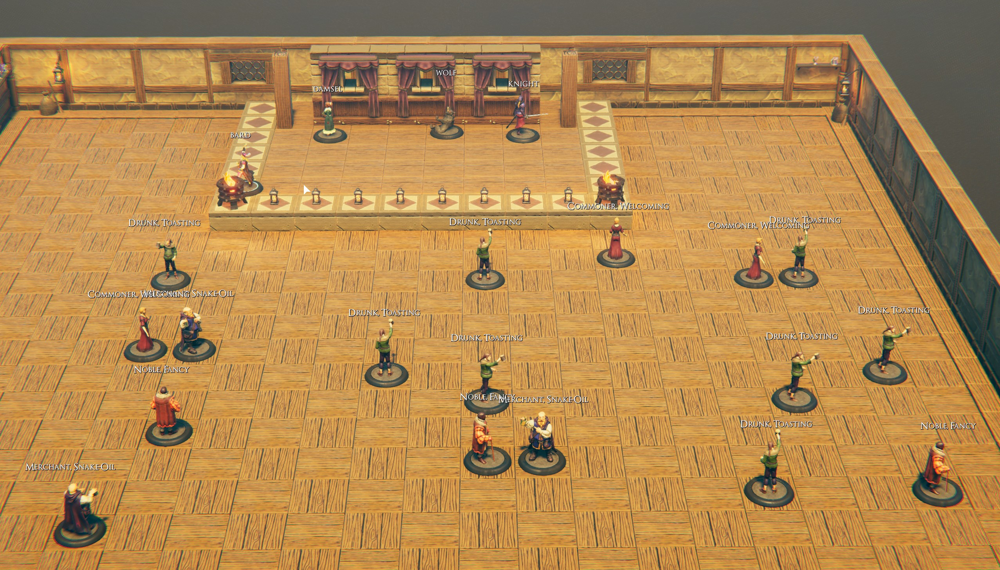

# Modding Tales Python Socket SDK

This is a single file and requires python 3 to be installed.  No other dependencies are needed.

This MUST be run on the same machine as the modded TaleSpire game since the socket only binds to 127.0.0.1 and no other IPs (intentionally).  If you wish to expose it to external networks you will have to recompile and make the change yourself.  The SDK itself is little more than wrapper functions around socket calls.

## Setup:

### Plugin Setup

Make sure you have installed the SocketAPIPlugin in the latest release [https://github.com/brcoding/moddingtalespire/releases/latest](https://github.com/brcoding/moddingtalespire/releases/latest) 

If you need help installing please see [http://moddingtales.com/dll-modding](http://moddingtales.com/dll-modding)

### SDK Setup

The SDK can be included by placing the moddingtalessdk.py file along side your script and adding:

```from moddingtalessdk import GetCreatureList, MoveCreature, GetCreatureIdByAlias, PlayEmote```

This will include a subset of the methods in the sdk. If you wish to import all of the methods:

```from moddingtalessdk import *```

## Usage

After importing the functions into your script you can call them as long as TaleSpire is running, there is no additional work that needs to be done.

## March Example

1. Paste the below slab into TaleSpire to create the stage.

 ```H4sIAAAAAAAAC32YTYgcRRTHK5NZM+AeBg8OIpLGiASJOGjQ4MJUtYYNRNAFwYBGMrAGgwc/QBBzkMYPcgjqmOwhhw2ZEAU/wB3YYRVD6GoCEQ/uapBF8WBOGkEh8WLUbMau6nlT1dXvvYZJeuq379X7v/equqdW/139fpO4Wey4rN48eOHZJ858cP7Keuuly3UhxG2tU0emTt6u3n7shU9W5gcHNudjZ+e7ay/u3xIv/744/fTX+w6187HZ53f8uraazh6NrrV2Xb0YPZePrW/cc/WV03ftXf75+P6p3z79x/i7d2nj2jMzP+55744try88ue/Epnzs8b/r/x3eePSRY1+1v/3s9Duv1vKx42cuXP9jpTf7bv3g8ra3vvjBjP2URHfOvX9sz9Iv30ztfXj9lkY+tvmv7L7aQ3fHR147sHDT4emT2/KxxsW1++fP79z9ZevoR6c+/7N1qzBXlAnRl0JcUkIksrhPZL3EXs58ZsiNkYwxNm3tVIz5bBRMmX+EGIyZ9ScbJoHFfZUV9ynOzNXLx1T+/Tvj27CO+b9eYoOAGXtgPYZ1GZ8Rw7Ss+uwycXaJOO2V4naLmWOYPmCYPmCYPmCYPmChPjHMx4g4zaWJOA/FjoVx+j6DOFci7RgWpybiNNqNLRanz7A6AKvE6bFKPhPHgjhXzHdglTjT4juaa+FYqD2RjqG1lbQGYGgPSjpnmolTE3H6DItTE3H682FxaiJOWyNFxwkMyycwLE5gaE8oppcUnU/YC7A4gWH5BIbFCQzdC0Txva/Ge2vH22PHTIUsdQz+Fu6LQuA+fRb69Fngc7TVPGcIn/ZD+PRZJc6d+XRMnJqKc+gYqj3DfQ5jxzCfwAKfC7tnvFynZbtdmVcjjfiE2gZsu2d3KbQTjjUzuifaDJsrs3Mz273apsh8GtVw7uwDXi+V2WhJOxZqsH41o0HjGkxPAJsLmfB6KdQw9HoQyWeCaxBXlGOVOng+Aw32+ZdQGrz5Qg12/yQ0+AzToAkNPqtoSByraFCOVXopdQzTMFkrWC9ltIbJ2sTWSkZo8OzCXjJ1AFapg+cz1GDXraL7DBi6xhQei2+HalB0/YCFOfPnw3KdMBqAof1JaLAfRkPCaEgIDT5De57RoBkNmtDgM2xf0owGzWjQhAZ7xbgGy2NaAzC0l2Kml2Jcgz8fuv5iWkNEaPAZth4iRkPEaIgIDT7D1kPEaJisFUkz7B1lsjZV1S5hfCaEz9JaQebTjE/N+NRMnJPayup8k55g7DCfEeGzVCNEX8T4NM/GvqyeeViOnnlM53v5jdFW5szD5AXzCRfFTqii9h/79ejUH3yqmfe6Rpm1M78pBrJm3+XNR3fE+DykJrqaYsX7f99jice6DItwZs9ttMTtEnl9NOqgrDka1eyzE7crfr/jsdTsGQQZ57h+UPe+dHUHpkI2dAz6x7cTRL+Yd2hNMHj2Y+xDzw7rJeiXgI1Gyy6W0M7GzbCJvpTJiw5Y4uWzzIqzC9AX2Jk5gDWzgHmxtDM6ljmEwblimRX9AqwdMN+uybCyhjLra3o+xdiVc90Yi6DrnhDMrgfGTjD7EsyH7T0JwWy+0TPc8dkFwybaJZ2X8vor57OvqnZmr1MyPCsp7IANGNYLmO+zy7CI8aklzYSs+uzh7I1EurOZ0C6R7pwIYyYGaj7BMDhzxFiXYOb3CrCwDmavAxbWYdGzw+oALKyDzYsm6pA6FtbBXHD2i+aFYZBTs4+afrT5jf8H79yXUQgaAAA=```

2. After pasting create the following characters on the stage:

    * damsel
    * knight
    * wolf
    * bard

3. For the audience just add a mix of:
 "Drunk, Toasting", "Noble, Fancy", "Merchant, Snake-Oil", "Commoner, Welcoming"

 When you are finished it should look something like: 

4. After the setup is complete you can run this example script and your characters will dance like marionettes 

To Run: ```python march.py```
